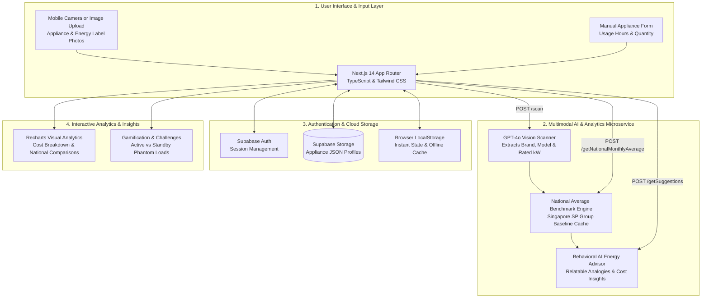

# ⚡ OhmSweetOhm — Multimodal AI Household Energy Auditor & Smart Cost Intelligence Platform

[](https://nextjs.org/)
[](https://react.dev/)
[](https://www.typescriptlang.org/)
[](https://tailwindcss.com/)
[](https://www.python.org/)
[](https://flask.palletsprojects.com/)
[](https://openai.com/)
[](https://supabase.com/)
[](https://www.docker.com/)
[](https://vercel.com/)
[](LICENSE)

> **Zero-Hardware Smart Energy Auditor**: A production web platform engineered to eliminate utility bill shock and phantom vampire loads in urban households.  
> Instead of requiring expensive IoT smart plugs or invasive home wiring, **OhmSweetOhm** uses **OpenAI GPT-4o Multimodal Computer Vision** to turn appliance photos into instant, itemized energy costs, Singapore national benchmark comparisons, and personalized behavioral savings insights.

---

## 🌟 Executive Summary

Rising electricity tariffs (such as Singapore SP Group's tariff of ~**$0.3257 / kWh**) have made utility bills a significant household pain point. Yet most consumers face three fundamental barriers to energy conservation:

1. **Information Asymmetry**: Utility meters only display total monthly consumption; homeowners cannot pinpoint which specific appliances drive the bulk of their bill.
2. **The Hardware Barrier**: Smart plugs, sub-meters, and home energy monitors cost hundreds of dollars, take hours to install, and rarely cover large fixed appliances.
3. **The "Phantom Load" Blindspot**: Standby power (appliances left plugged in while turned off) silently drains **10% to 15%** of household electricity each month.

**OhmSweetOhm** bridges this gap by delivering an effortless, software-only audit experience. Users simply photograph appliance labels or models. The platform extracts technical specs via computer vision, models real-world usage scenarios, benchmarks consumption against national standards, and translates abstract kilowatt-hours into relatable daily expenses (e.g., *"Your AC is costing you 6 bubble teas a month 🧋"*).

---

## 🏛️ System Architecture



<details>
<summary><b>🔍 View Mermaid Source Code</b></summary>



</details>

---

## 🚀 Key Platform Capabilities

### 👁️ 1. Multimodal AI Appliance Scanner (`GPT-4o Vision`)
* **Zero-Manual-Entry Onboarding**: Users snap a photo of an appliance or its energy efficiency label.
* **Intelligent Spec Extraction**: The Flask microservice base64-encodes the image and queries OpenAI's `gpt-4o` multimodal API, extracting the appliance category, brand, model, and rated power usage in kiloWatts (kW) in strict JSON format.
* **Flexible Input Methods**: Supports single/batch image upload, direct mobile camera capture, or manual spec overrides (rated watts, kiloWatts, or voltage $\times$ current).

### ⚡ 2. Precision Cost Modeling & Real-Time Tariff Calculation
* **Calibrated Formula**:
  $$\text{Monthly Cost (SGD)} = \text{Usage (hrs/day)} \times 31 \times \text{Power (kW)} \times \text{Tariff} \times \text{Quantity}$$
* **Default Baseline**: Calibrated to Singapore Energy Market Authority (EMA) / SP Group tariff rates (`$0.3257 / kWh`), dynamically adjustable per user region.
* **Instant Interactive Recalculation**: Powered by React state reducers and `useMemo` hooks, allowing users to slide usage hours and instantly visualize the financial impact of changing their daily habits.

### 📊 3. National Household Benchmarking Engine
* **Contextualizing Consumption**: Users are informed whether their appliances consume more or less power than the Singapore national average.
* **Hybrid Cache Architecture**: High-frequency appliances (Air Conditioners, Refrigerators, Kettles, Washing Machines) are served from an in-memory benchmark cache. Unseen or custom appliances trigger a contextual `GPT-4o` query to estimate Singapore-specific averages, caching the result for future users.

### 💡 4. Relatable Behavioral AI & Actionable Insights
* **Combating Cognitive Overload**: Abstract metrics like "18.5 kWh" mean little to everyday homeowners. OhmSweetOhm converts numbers into culturally relatable daily analogies (e.g., comparing air conditioning costs to bubble teas or hawker meals).
* **Actionable Climate-Specific Tips**: Generates micro-suggestions (e.g., *"Set AC to 25°C and use fans to save ~$22/month"*) with emoji-rich, skimmable UI cards.

### 👻 5. Phantom / Vampire Load Awareness
* **Exposing Standby Waste**: Dedicated exploratory module breaking down the difference between active usage vs. passive vampire drain across 10+ standard household categories (TVs, microwaves, chargers, gaming consoles).

### 🏆 6. Community Energy Saving Challenge
* **Real-World Pilot**: Piloted a gamified community challenge offering tangible incentives (NTUC FairPrice vouchers) to drive sustainable habits, gathering real user feedback to iterate on UI ergonomics.

---

## 🛠️ Technology Stack Matrix

| Domain | Technology / Library | Purpose |
| :--- | :--- | :--- |
| **Frontend Framework** | **Next.js 14** (App Router), React 18 | High-performance server-rendered and client-rendered application |
| **Language & Typing** | **TypeScript 5** | Strict type safety across all appliance models and API contracts |
| **Styling & Design** | **Tailwind CSS**, PostCSS | Modern responsive mobile-first UI with custom palette tokens |
| **Data Visualization** | **Recharts** | Interactive SVG PieCharts with dynamic HSL color distancing & BarCharts |
| **Iconography** | **Lucide React** | Clean, accessible iconography |
| **Backend API** | **Python 3.12**, **Flask 2.3** | Lightweight REST microservice handling AI and computation |
| | **Flask-CORS**, **Requests**, **Gunicorn** | Cross-origin request processing & external HTTP client |
| **Artificial Intelligence** | **OpenAI GPT-4o** Multimodal Vision | Zero-shot optical extraction of appliance specs from user photos |
| | **OpenAI GPT-4o** Text Generation | Dynamic national benchmark estimation & behavioral advice synthesis |
| **Auth & Cloud Storage** | **Supabase Auth** & **Supabase Storage** | Passwordless/OAuth session management & cloud JSON profile persistence |
| **State & Local Storage** | **Browser LocalStorage** + React Reducer | Optimistic UI updates with resilient offline-first fallback |
| **Telemetry & Analytics** | **Microsoft Clarity**, Google Analytics | User session recordings, heatmaps, and funnel drop-off analytics |
| **DevOps & Containers** | **Docker**, Docker Compose, **Vercel** | Containerized local execution and production cloud serverless hosting |

---

## 💻 Local Development Setup

### Prerequisites
* **Node.js**: `18.x` or `20.x` & `npm`
* **Python**: `3.11` or `3.12`
* **OpenAI API Key**: Required for image scanning and intelligent suggestions
* **Supabase Account** (Optional for local testing, required for cloud persistence)

---

### 1. Clone the Repository
```bash
git clone https://github.com/influasher/ohm_sweet_ohm.git
cd ohm_sweet_ohm
```

---

### 2. Backend Setup (Flask AI Service)

In your first terminal window:
```bash
cd backend

# 1. Create and activate a virtual environment
python3 -m venv .venv
source .venv/bin/activate  # On Windows: .venv\Scripts\activate

# 2. Install dependencies
pip install -r requirements.txt

# 3. Create environment configuration
cat <<EOF > .env
OPENAI_API_KEY=your_openai_api_key_here
FLASK_ENV=development
EOF

# 4. Start Flask backend server
python app.py
# Backend API runs on http://localhost:5000
```

---

### 3. Frontend Setup (Next.js Application)

In a second terminal window:
```bash
# From repository root
cd /path/to/ohm_sweet_ohm

# 1. Install dependencies
npm install

# 2. Configure Environment Variables
cat <<EOF > .env.local
NEXT_PUBLIC_SUPABASE_URL=your_supabase_project_url
NEXT_PUBLIC_SUPABASE_ANON_KEY=your_supabase_anon_key
EOF

# 3. Start Next.js development server
npm run dev
# Open http://localhost:3000 in your browser
```

---

### 4. Running with Docker Compose

To spin up the containerized backend:
```bash
docker compose up --build
```

---

## 🏆 Key Engineering Achievements & Interview Highlights

When discussing this project in software engineering, full-stack, and product engineering interviews, here are the technical highlights:

1. **Multimodal Computer Vision in Production**:
   Engineered an end-to-end optical ingestion pipeline that parses noisy, unstandardized appliance photos and regulatory energy rating labels, returning structured JSON with fallback handling for unidentifiable fields.
2. **Resilient Offline-First Data Synchronization**:
   Implemented a hybrid persistence model: user modifications immediately reflect via React reducers and persist to `localStorage` for instant, latency-free feedback, while asynchronously syncing snapshots to Supabase Cloud Storage.
3. **Dynamic HSL Color Distance Algorithm for Accessible Charts**:
   Authored a custom Euclidean color-distance algorithm in 3D HSL space (`getColorDistance`) inside `Breakdown.tsx` to programmatically generate visually distinct chart colors for arbitrary appliance counts, avoiding visual collisions and accessibility issues.
4. **Intelligent Tiered Benchmarking Cache**:
   Architected a multi-tier caching system for Singapore household benchmarks: common appliances return sub-millisecond cached responses, while uncommon appliances query GPT-4o on-demand and write back to the cache, optimizing API costs and response latency.
5. **Real-World Deployment & Pilot Validation**:
   Successfully launched a public pilot in Singapore with telemetry tracking (Microsoft Clarity & Google Analytics) to optimize user conversion funnels from landing page through scan completion.

---

## 📂 Project Structure

```
ohm_sweet_ohm/
├── app/                           # Next.js 14 App Router
│   ├── page.tsx                   # Interactive product landing page
│   ├── home/                      # User dashboard & audit kickoff
│   ├── create/                    # Camera scanner & manual appliance input
│   ├── estimate/                  # Appliance list & cost calculator
│   │   └── results/               # Infographics, PieCharts & BarChart benchmarks
│   ├── commonCost/                # Active vs. Phantom vampire load explorer
│   ├── energySavingChallenge/     # Gamified community challenge campaign
│   └── login/                     # Supabase authentication
├── backend/                       # Python Flask Microservice
│   ├── app.py                     # Flask endpoints (/scan, /getSuggestions, etc.)
│   ├── ai_functions.py            # OpenAI GPT-4o vision & suggestion prompt logic
│   ├── requirements.txt           # Python dependencies
│   └── Dockerfile                 # Backend containerization
├── components/                    # Reusable React components
│   ├── Topbar.tsx                 # Responsive navigation bar
│   ├── Footer.tsx                 # Global footer
│   ├── ApplianceCardComponent.tsx # Individual appliance item card
│   └── PromoBanner.tsx            # Campaign announcement banner
├── types/                         # TypeScript interfaces
│   └── appliance.ts               # Core Appliance data structures
├── utils/                         # Helper utilities
│   └── supabase/                  # Supabase SSR client, server, & middleware
├── public/                        # Static assets & illustrations
├── docker-compose.yml             # Container orchestration
└── Dockerfile                     # Multi-stage Next.js production build
```

---

## 👥 Authors & Team Contributions

Developed as a sustainability and smart energy initiative:

* **Asher Laiu** ([@influasher](https://github.com/influasher)) — *Full-Stack Architecture, Multimodal AI Vision Integration, State Management Reducers, Recharts Visualizations & Cloud Deployment*
* **Jared Choy Jiele** ([@choyboys](https://github.com/choyboys)) — *UI/UX Design, Frontend Components, Landing Page Ergonomics & Energy Saving Challenge Module*
* **Brandon Hong** ([@brandonhjh](https://github.com/brandonhjh)) — *Visual Assets, Common Cost Engine, Content Strategy & Compliance*

---

## 📄 License

This project is licensed under the terms of the [MIT License](package.json).
